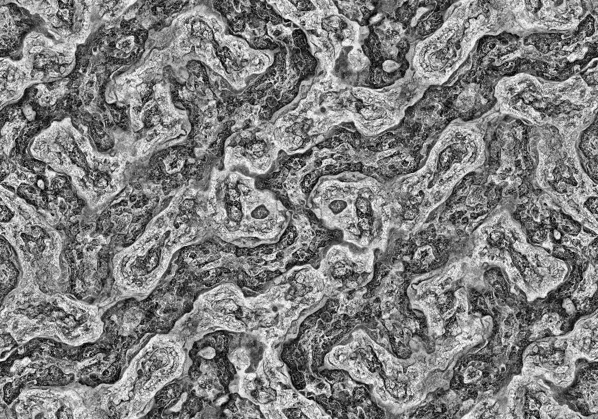
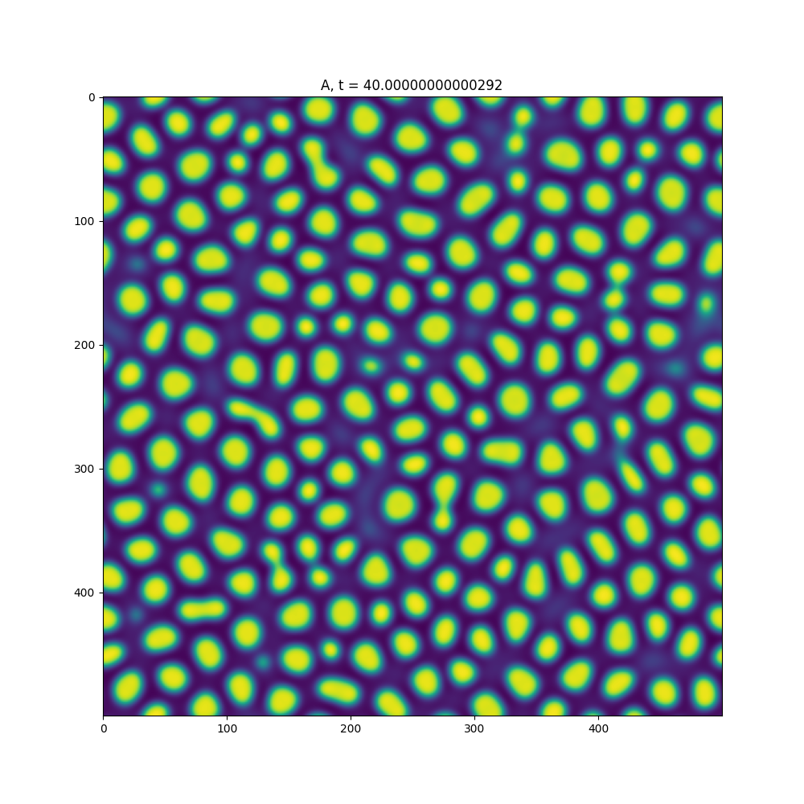

# reaction_diffusion_sim
## Lauréat national des Trophées NSI


### Le projet Morphogénie a été nominée par le jury national pour le prix de l'ingénierie du concours "Les Trophées NSI" de 2023
<hr>

## Simulations de systèmes de réaction-diffusion, motifs de Turing à échelles multiples


Les modèles de Turing et sont une forme de système de réaction-diffusion développés par le mathématicien Alan Turing dans les années 1950. Ils ont une grande importance en mathématiques appliquées, en biologie et en chimie pour comprendre comment les motifs spatiaux se forment à partir de réactions chimiques complexes.

Les systèmes de réaction-diffusion sont des systèmes dynamiques qui décrivent comment les concentrations de différentes espèces chimiques évoluent dans l'espace et dans le temps. Ces systèmes sont basés sur des équations de réaction-diffusion, qui prennent en compte à la fois les réactions chimiques entre les différentes espèces et les effets de diffusion qui les font se déplacer dans l'espace. L'objectif de ce projet est de simuler ces systèmes de réaction-diffusion.


## Installation
1.	Cloner le répertoire du projet et entre dans le dossier
```
$ git clone https://github.com/spicyboi26/reaction_diffusion_sim 
$ cd reaction_diffusion_sim
```

2.	Installer les bibliothèques nécessaires  
```
$ pip install -r requirements.txt
```

### Dépendances
LANGAGE: Python 3.9.13

LIBRAIRIES:  
matplotlib==3.5.1  
numpy==1.22.3  
opencv_python==4.7.0.72  
scipy==1.10.1  

## Tutorial
```
optional arguments:
  -h, --help            show this help message and exit
  -L LONGUEUR, --longueur LONGUEUR
                        Longueur de l'affichage
  -l LARGEUR, --largeur LARGEUR
                        Largeur de l'affichage
  -o OPTION, --option OPTION
                        1. Simulation 2. Graphique 3. Video/GIF
  -fi FICHIER, --fichier FICHIER
                        Nom du fichier qui stocke le résultat.
  -p P                  Choix parmi la liste de valeurs prédéfinies
  -ap                   Afficher les valeurs prédéfinies
  -e ETAPES, --etapes ETAPES
                        Nombre d'étapes exécutées à chaque itération
  -ne NB_ETAPES, --nb_etapes NB_ETAPES
                        Nombre d'itérations exécutées pour la vidéo ou l'image
  -s SYMETRIE, --symetrie SYMETRIE
                        Nombre de symétries rotationnelles
  -c COULEUR, --couleur COULEUR
                        Couleur (deux lettres appartenant à 'rgb') : la
                        première lettre correspond à celle de la substance A,
                        et la deuxième à celle de la substance B. Si les 2
                        lettres sont identiques, on n'affichera que la
                        substance B
  -m MODELE, --modele MODELE
                        Système d'équations utilisé: Fitzugh-Nagumo('fn') ou
                        Gray-Scott('gs')
  -r, --rogner          Rogner l'image pour éviter les zones floues produites
                        par les symétries
  -dt DT                Période de temps entre chaque étape
  -Da DA                Vitesse de propagation de la substance a
  -Db DB                Vitesse de propagation de la substance b
  -a A                  Valeur de alpha pour la simulation Fitzugh-Nagumo
  -b B                  Valeur de beta pour la simulation Fitzugh-Nagumo
  -f F                  'feed rate': vitesse d'accroissement dans la
                        simulation Gray-Scott
  -k K                  'kill rate': vitesse de disparition dans la simulation
                        Gray-Scott
  -ra RA                Rayons des activateurs
  -ri RI                Rayons des inhibiteurs
```
La simulation à 1 dimension possède un quatrième option, qui suit l'évolution du système à travers le temps en créant une image où chaque colonne représente la concentration de la substance A à une étape.
On peut également directement modifier les paramètres des simulations, mais cela nécessite une connaissance du modèle mathématique utilisé. La totalité des arguments peut être retrouvée dans le fichier `commandes.py`. Dans le cas du choix d'un graphique ou d'une vidéo, le résultat est stocké dans le répertoire `src/rendus/`.


## Fonctionnement
### Systèmes de réaction-diffusion


Les modèles de réaction-diffusion décrivent l'évolution de concentrations de deux réactifs A et B dans l'espace. Ce modèle mathématique est décrit par les équations:
$$\frac{\partial A}{\partial t} = D_A\nabla_A+R_A$$
$$\frac{\partial B}{\partial t} = D_B\nabla_B+R_B$$
où $D_a$ et $D_B$ sont les vitesses diffusion des substances A et B et $\nabla$ est l'opérateur laplacien. $R_A$ et $R_B$ varient selon le modèle utilisé: 
Fitzugh-Nagumo:
$$R_A(A,B)=A-A^3-B+\alpha$$
$$R_B(A,B)=\beta(A-B)$$


Equations Gray-Scott:
$$R_A(A,B)=-AB^2+f(1-A)$$
$$R_B(A,B)=AB^2-(f+k)B$$

Pour simuler ces équations de réaction-diffusion, on utilise la [Méthode des différences finies](https://fr.wikipedia.org/wiki/M%C3%A9thode_des_diff%C3%A9rences_finies): A chaque itération, on calcule la valeur discrétisée de $\frac{\partial A}{\partial t}$ et $\frac{\partial B}{\partial t}$, et on les ajoute aux tableau A et B

### Motifs de Turing à échelles multiples
La simulation des motifs de Turing à échelles multiples consiste à lancer simultanément plusieures simulations de réaction-diffusion, de calculer leur variances, et d'ajuster la valeur de chaque pixel du tableau affiché avec celui qui a la plus petite variance
Voici l'algorithme(tiré de ce [blog](https://softologyblog.wordpress.com/2011/07/05/multi-scale-turing-patterns/)):
On commence par choisir, pour chaque échelle, un rayon d'activateur, un rayon d'inhibiteur et une petite quantité
Pour chaque échelle:
1. Faire la moyenne de chaque emplacement de cellule de grille sur un rayon circulaire spécifié par le rayon de l'activateur et stocker le résultat dans le tableau de l'activateur. 
2. Faites la moyenne de chaque emplacement de cellule de grille sur un rayon circulaire spécifié par le rayon de l'inhibiteur et stockez le résultat dans le tableau de l'inhibiteur. 
3. Déterminer la variation à chaque emplacement de la grille. Calculer la variation en utilisant l'identité `variation=variation+abs(activateur[x,y]-inhibiteur[x,y])`. 

Une fois qu'on a enfin toutes les valeurs d'activateur, d'inhibiteur et de variation pour chaque échelle calculées, les cellules de la grille principale peuvent être mises à jour. Ceci est fait par:
1. Trouver quelle échelles a la plus petite valeur de variation, c'est-à-dire trouver quelle échelle a la valeur de variation `[x, y, echelle]` la plus faible et appeler cette meilleure variation
2. En utilisant l'échelle avec la plus petite variation, mettez à jour la valeur de la grille
si `activateur[x,y,variation_min]>inhibiteur[x,y,variation_min]` alors
`grille[x,y] :=grille[x,y]+petites_quantités[variation_min]`
sinon
`grille[x,y] :=grille[x,y]-petites_quantités[variation_min]`

Afin d'être plus efficace, notre implémentation ne stocke que les variations des différentes échelles, et pas leurs valeurs. Nous avons également omis les petites valeurs qui règlent l'incrémentation du tableau.
On exploite églament la propriété qui dit que la transformée de Fourier d'un produit de convolution s'obtient par multiplication des transformées de Fourier des fonctions :
$$r(x)=\\{g\ast h\\}(x)=\mathscr{F}^{-1}\\{G\cdot H\\}$$
