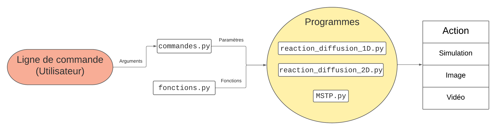

# Fonctionnement
## Systèmes de réaction-diffusion

Les modèles de réaction-diffusion décrivent l'évolution de concentrations de deux réactifs A et B dans l'espace. Ce modèle mathématique est décrit par les équations:
$$\frac{\partial A}{\partial t} = D_A\nabla_A+R_A$$
$$\frac{\partial B}{\partial t} = D_B\nabla_B+R_B$$
où $D_a$ et $D_B$ sont les vitesses diffusion des substances A et B et $\nabla$ est l'opérateur laplacien. $R_A$ et $R_B$ varient selon le modèle utilisé: 

Fitzugh-Nagumo:
$$R_A(A,B)=A-A^3-B+\alpha$$
$$R_B(A,B)=\beta(A-B)$$

Equations Gray-Scott:
$$R_A(A,B)=-AB^2+f(1-A)$$
$$R_B(A,B)=AB^2-(f+k)B$$

Pour simuler ces équations de réaction-diffusion, on utilise la [Méthode des différences finies](https://fr.wikipedia.org/wiki/M%C3%A9thode_des_diff%C3%A9rences_finies): A chaque itération, on calcule la valeur discrétisée de $\frac{\partial A}{\partial t}$ et $\frac{\partial B}{\partial t}$, et on les ajoute aux tableau A et B

## Motifs de Turing à échelles multiples
La simulation des motifs de Turing à échelles multiples consiste à lancer simultanément plusieures simulations de réaction-diffusion, de calculer leur variances, et d'ajuster la valeur de chaque pixel du tableau affiché avec celui qui a la plus petite variance
Voici l'algorithme(tiré de ce [blog](https://softologyblog.wordpress.com/2011/07/05/multi-scale-turing-patterns/)):
On commence par choisir, pour chaque échelle, un rayon d'activateur, un rayon d'inhibiteur et une petite quantité
Pour chaque échelle:
1. Faire la moyenne de chaque emplacement de cellule de grille sur un rayon circulaire spécifié par le rayon de l'activateur et stocker le résultat dans le tableau de l'activateur. 
2. Faites la moyenne de chaque emplacement de cellule de grille sur un rayon circulaire spécifié par le rayon de l'inhibiteur et stockez le résultat dans le tableau de l'inhibiteur. 
3. Déterminer la variation à chaque emplacement de la grille. Calculer la variation en utilisant l'identité `variation=variation+abs(activateur[x,y]-inhibiteur[x,y])`. 

Une fois qu'on a enfin toutes les valeurs d'activateur, d'inhibiteur et de variation pour chaque échelle calculées, les cellules de la grille principale peuvent être mises à jour. Ceci est fait par:
1. Trouver quelle échelles a la plus petite valeur de variation, c'est-à-dire trouver quelle échelle a la valeur de variation `[x, y, echelle]` la plus faible et appeler cette meilleure variation
2. En utilisant l'échelle avec la plus petite variation, mettez à jour la valeur de la grille
si `activateur[x,y,variation_min]>inhibiteur[x,y,variation_min]` alors
`grille[x,y] :=grille[x,y]+petites_quantités[variation_min]`
sinon
`grille[x,y] :=grille[x,y]-petites_quantités[variation_min]`

Afin d'être plus efficace, notre implémentation ne stocke que les variations des différentes échelles, et pas leurs valeurs.
On exploite églament la propriété qui dit que la transformée de Fourier d'un produit de convolution s'obtient par multiplication des transformées de Fourier des fonctions :
$$r(x)=\\{g\ast h\\}(x)=\mathscr{F}^{-1}\\{G\cdot H\\}$$

Ainsi, pour chaque échelle de la simulation, on actualise la variance de la manière suivante:
$$V := T\ast (N_{activiteurs}-N_{inhibiteurs})$$
$$\Leftrightarrow V := \mathscr{F}^{-1}\left\{\mathscr{F}\{T\}\cdot\mathscr{F}\{N_{activiteurs}-N_{inhibiteurs}\}\right\}$$

# Architecture du projet
### Dépendances
LANGAGE: Python 3.9.13

LIBRAIRIES:  
matplotlib==3.5.1  

numpy==1.22.3  

opencv_python==4.7.0.72  

scipy==1.10.1  

Le programme est fait pour être exécuté depuis la ligne de commande, en choississant un des programmes, puis en configurant la simulation à travers différents arguments, qui changent les paramètres de la simulation (une présentation des commandes est détaillée dans le [guide](guide.md) )

| Fichier                    | Fonction                                                                                                                                                                                        |
| -------------------------- | ----------------------------------------------------------------------------------------------------------------------------------------------------------------------------------------------- |
| `reaction_diffusion_1D.py` | Simule un système de réaction-diffusion en 1 dimension, avec la classe `Simulation1D`.                                                                                                          |
| `reaction_diffusion_2D.py` | Simule un système de réaction-diffusion en 1 dimension, avec la classe `Simulation2D`.                                                                                                          |
| `MSTP.py`                  | Simule les motifs de Turing à échelles multiples en utilisant la classe `MSTP`.                                                                                                                 |
| `fonctions.py`             | Ce fichier contient l'ensemble des fonction extérieures aux classes qui sont utilisées, afin de rendre le code plus clair, et de permettre le partage de fonctions entre différents programmes. |
| `commandes.py`             | Utilise la librairie argparse pour gérer l'interface de commande de ligne.                                                                                                                      |

Nous avons choisi une architecture orientée objet pour notre programme, en créant des classes, car cette méthode offre plusieurs avantages. Elle permet de rendre le code clair, modulaire et facilement extensible, et elle permet également d'utiliser une seule classe pour simuler plusieurs modèles de réaction-diffusion.

Toutes les images et les vidéos produites sont stockées dans le répertoire `src/rendus/`. Le format des images est celui précisé dans le nom du fichier, et celui des vidéos est le format mp4.